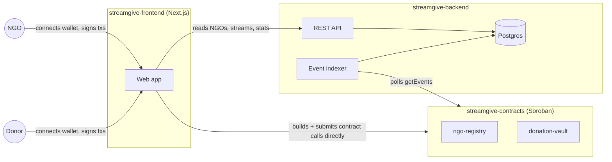

# Architecture

StreamGive is three cooperating pieces, plus this docs site. The most
important thing to understand about the split: **the contracts are the
only source of truth.** The backend's database is a read-optimized mirror
of on-chain state, not a second copy of it — nothing is true because the
backend says so, only because the chain says so.

## The contracts (source of truth)

Two Soroban contracts, deployed independently:

- **ngo-registry** — NGOs self-register with `register`, and an admin
  verifies them with `approve_ngo`. Owns exactly one fact: whether a given
  address is a verified NGO.
- **donation-vault** — holds every stream's escrowed balance. Donors call
  `create_stream`, `top_up`, `modify_rate`, and `cancel_stream`; NGOs call
  `withdraw`. It doesn't check the registry itself — a stream can target
  any address, verified or not, which is a deliberate choice discussed
  more in the deployment guide.

Both emit events on every state change. That event stream is the *only*
channel the backend uses to learn what happened — there's no other
integration point between the backend and the contracts.

## The backend (indexer + API)

The indexer polls the contracts' events on an interval, and turns each one
into a write against a normal relational schema: `ngos`, `donors`,
`streams`. This exists purely so the frontend can ask questions like "list
verified NGOs" or "sum this NGO's total donations" without the frontend
having to scan on-chain event history itself on every page load.

The backend also owns a few things that have no on-chain equivalent at
all: the NGO application intake form, admin review of those applications,
and outbound notifications. Those are genuinely backend-owned state, not a
mirror of anything — the API reference page (coming soon) covers the full
split.

Critically, **the backend never holds funds or signs transactions.** Every
contract call in the system is built and signed in the donor's or NGO's
own browser, using their own wallet. If the backend disappeared entirely,
every stream already running would keep running exactly as the contract
defines it — the app would just lose its dashboard.

## The frontend

A Next.js app that does two distinct things, deliberately kept separate:

- **Reads** (NGO lists, stats, a donor's streams) go to the backend API —
  fast, queryable, and fine to be a few seconds stale, since it's just a
  view.
- **Writes** (creating, modifying, cancelling a stream; an NGO's withdraw;
  an admin's approval) go straight from the browser to the contracts via
  [`@stellar/stellar-sdk`'s contract client](https://developers.stellar.org/docs/build/guides/transactions/invoke-contract-tx-sdk),
  signed by whichever wallet the user connected through
  [Stellar Wallets Kit](https://stellarwalletskit.dev/). The backend is
  never in this path.

That split is why a stale indexer is an inconvenience, not a security
problem: it can only ever make the *dashboard* wrong, never the contracts.
